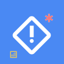
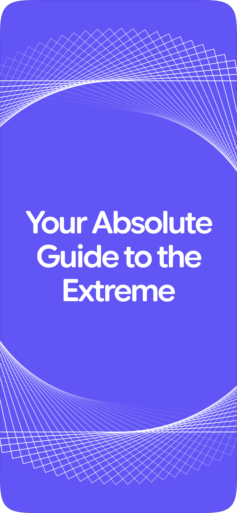
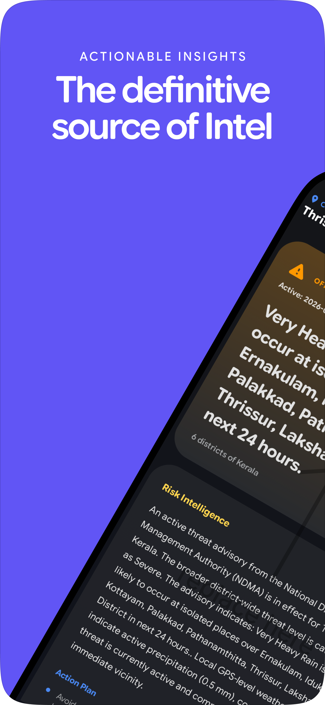
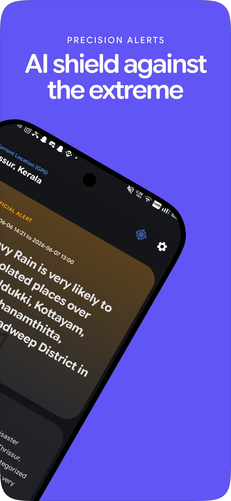
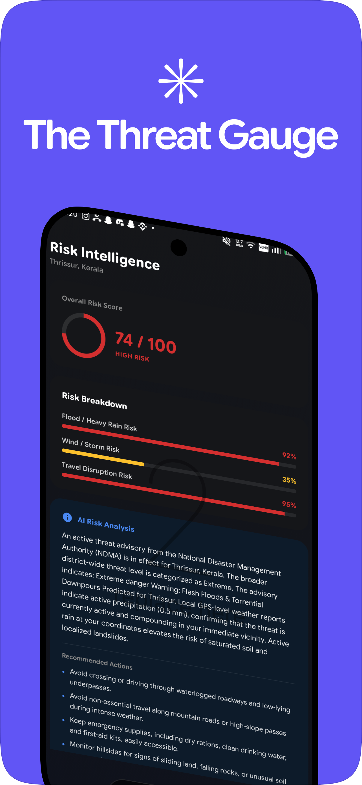
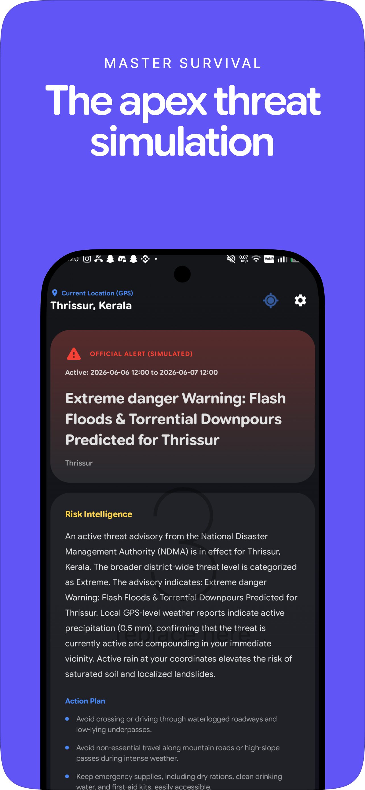
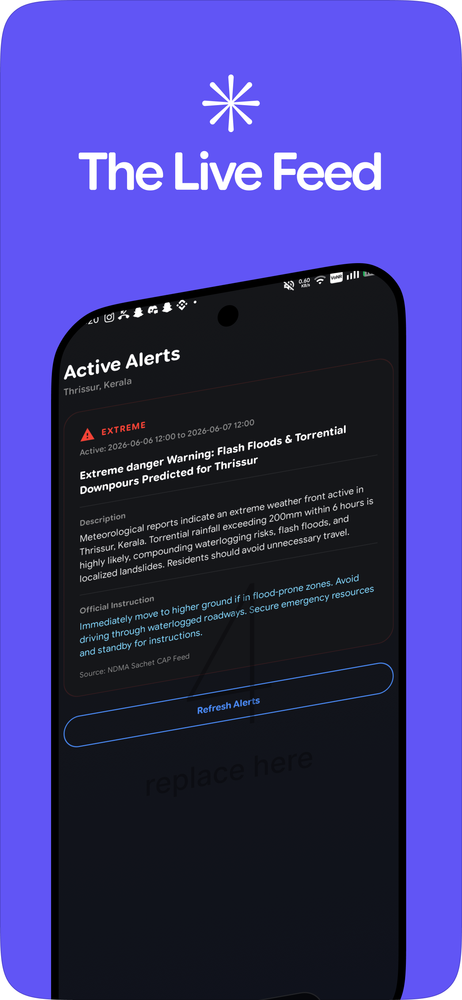
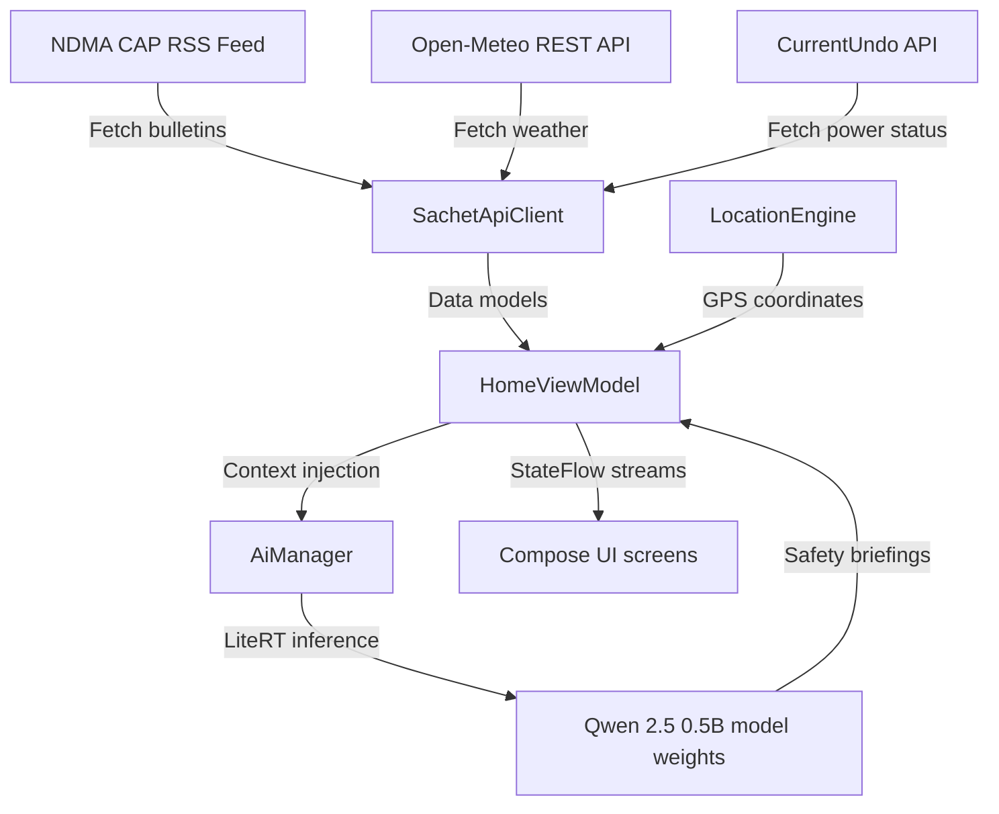

#  AerisIQ

[](https://developer.android.com)
[](https://kotlinlang.org)
[](#-privacy-by-design)
[](#-on-device-intelligence-core)
[](LICENSE)

**AerisIQ** is a Free and Open Source Software (FOSS), privacy-first disaster risk intelligence and local safety utility application for Android.

The app queries public warning feeds, parses raw disaster bulletins, combines them with live local weather telemetry, and processes the combined datasets using an **offline Large Language Model (LLM)** running securely in the device's sandbox.

---

## 📸 Screenshots & Interface

AerisIQ features a premium dark glassmorphic design system using Google Sans Flex variable-axis typography and directional page-slide transitions:

| | | |
|:---:|:---:|:---:|
|  |  |  |
| **Intro & Guide** | **Actionable Insights** | **AI Threat Shield** |
|  |  |  |
| **Threat Gauge** | **Apex Simulation** | **The Live Feed** |

---

## 🏗️ System Architecture

AerisIQ is built using standard Clean Architecture principles mapped to the MVVM pattern:



### 📂 Directory Structure
```
AerisIQ/
├── app/
│   ├── src/main/
│   │   ├── AndroidManifest.xml       # Main application manifest and permission setup
│   │   ├── java/com/example/aerisiq/
│   │   │   ├── MainActivity.kt        # Edge-to-edge transparent system bar initialization
│   │   │   ├── ai/
│   │   │   │   ├── AiManager.kt       # MediaPipe/LiteRT JNI wrapper for local LLM inference
│   │   │   │   └── ModelDownloader.kt # System DownloadManager handler for model weight packs
│   │   │   ├── data/
│   │   │   │   └── IndiaStatesData.kt # Static lookup for Indian states and districts
│   │   │   ├── location/
│   │   │   │   └── LocationEngine.kt  # Local FusedLocationProviderClient coordinates lookup
│   │   │   ├── network/
│   │   │   │   ├── CapAlert.kt        # Parsed CapXML alert data classes
│   │   │   │   └── SachetApiClient.kt # Sachet CAP XML parser & Open-Meteo REST client
│   │   │   └── ui/
│   │   │       ├── AerisIQApp.kt      # Main app entry, Navigation graph, transitions
│   │   │       ├── navigation/
│   │   │       │   └── Routes.kt      # Strong-typed Route declarations
│   │   │       ├── screens/
│   │   │       │   ├── HomeScreen.kt  # Dashboard, pull-to-refresh, manual geocoding selector
│   │   │       │   ├── Onboarding.kt  # Onboarding slides, optional location permissions UI
│   │   │       │   ├── Settings.kt    # SharedPreferences configs, model validation tool
│   │   │       │   ├── AboutScreen.kt # Developer and platform context panel
│   │   │       │   ├── PrivacyPolicyScreen.kt  # Comprehensive zero-telemetry policy screen
│   │   │       │   └── TermsConditionsScreen.kt # Liability waiver warning cards
│   │   │       ├── theme/
│   │   │       │   ├── Color.kt       # Dark glassmorphism token definitions
│   │   │       │   └── Theme.kt       # Compose Material 3 dark gradient theme setup
│   │   │       └── viewmodels/
│   │   │           └── HomeViewModel.kt # StateFlow management, cache invalidation, prompt building
│   │   └── res/
│   │       ├── drawable/
│   │       │   └── ic_launcher.png    # App brand launcher icon resource
│   │       └── font/
│   │           └── google_sans_flex.ttf # Variable font layout resource
```

---

## 🔒 Privacy by Design

AerisIQ is built to operate under strict user-sovereignty principles:
* **100% Offline AI**: Safety summaries are executed client-side. No chat logs or prompts are transmitted to remote servers.
* **Geocoding API**: Coordinates are resolved via client-side API requests. If location permissions are withheld, you can select your region manually.
* **Zero Telemetry**: No analytical trackers, crash report servers, or advertisement loggers are present.
* **Purge Control**: Clearing application storage physically deletes all local preference files and downloaded AI weights permanently.

---

## 🧠 On-Device Intelligence Core

The app downloads the **Qwen 2.5 0.5B Instruct model (~380 MB)** from HuggingFace on first startup:
* **Runtime**: Handled via Google LiteRT (TFLite) using MediaPipe LLM Inference APIs.
* **Prompt Isolation**: Tonal guidelines prevent sensationalism, enforcing objective and calm summaries.
* **Safety Lock**: For warnings classified as extreme (e.g. `RED` threat alerts), the app displays a 6-step checklist card. Users must check off all 6 safety procedures before the AI analysis and weather risk vectors are unlocked.

---

## 🚀 Building & Deploying Locally

### Prerequisites
* **Android Studio Jellyfish (2023.3.1) or higher**.
* **Android SDK 34** (compiled with Java 17).
* A physical device or emulator with at least 1.5 GB of free storage for the model download.

### Steps
1. **Clone the repository**:
   ```bash
   git clone https://github.com/yourusername/AerisIQ.git
   cd AerisIQ
   ```
2. **Open the project**:
   - Select Open in Android Studio and target the `AerisIQ/` directory.
3. **Synchronize Gradle dependencies**:
   - Let Android Studio download dependencies including Material 3, Navigation Compose, and the MediaPipe Tasks library.
4. **Compile the project**:
   ```bash
   ./gradlew compileDebugKotlin
   ```
5. **Run and Install**:
   ```bash
   ./gradlew installDebug
   ```

---

## ⚖️ Legal Disclaimer

AerisIQ is an experimental public safety utility. AI-generated warnings and safety recommendations are compiled from general disaster management directives. They do not constitute official emergency advice. Users must always prioritize directions from civil defense, local police, and official government announcements.

---

## 📄 License

Licensed under the **Apache License 2.0**. See the [LICENSE](LICENSE) file for details.
